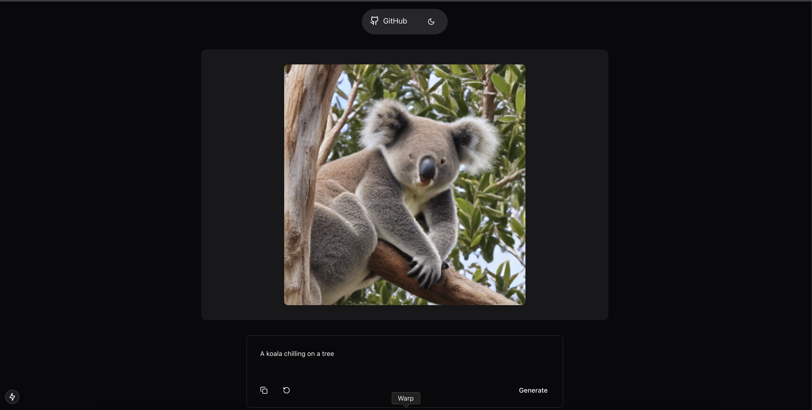

# 🐨Imagine Modal Starter🐨

A full-stack text-to-image generation starter app built with Next.js and Modal. This project provides a production-ready foundation for building AI-powered image generation applications with automatic scaling and reliable API endpoints.



## Tech Stack

- **Frontend**: [Next.js 15](https://nextjs.org/docs/) (TypeScript, Tailwind CSS)
- **UI Components**: [shadcn/ui](https://ui.shadcn.com/)
- **Backend**: [Modal](https://modal.com/)

## Getting Started

### Backend Setup

1. Create a [Modal](https://modal.com/) account
2. Install Modal CLI and authenticate:

```bash
pip install modal
modal token new
```

3. Temporarily deploy the backend:

```bash
cd backend
modal serve app.py
```

Note: `modal serve` is used for ephemeral deployments (CTRL+C stops the server). For a persisted deployment, use `modal deploy`.

Save the deployment URL - it will look like: `https://[ORG_NAME]--[APP_NAME]-generate.modal.run`

### Frontend Setup

1. Clone the repo
2. Install dependencies:

```bash
pnpm install
# or
npm install
# or
yarn install
# or
bun install
```

3. Create `.env.local` and add your Modal URL:
```bash
cp .env.example .env.local
```

4. Run the development server:

```bash
pnpm dev
# or
npm run dev
# or
yarn dev
# or
bun dev
```

Open [http://localhost:3000](http://localhost:3000) to see the app.

## Usage

1. Enter a text prompt in the input field
2. Click "Generate" or press Enter
3. Wait for your image to be generated
4. Use the copy button to save prompts you like
5. Try the "Surprise me" button for random prompt ideas

## TODO

- [ ] Add CI/CD for Modal backend as per [this guide](https://modal.com/docs/guide/continuous-deployment)
- [ ] Display the image generation time

## Contributing

Contributions are welcome! Please feel free to submit a Pull Request.

## License

MIT License - feel free to use this starter for any project!
